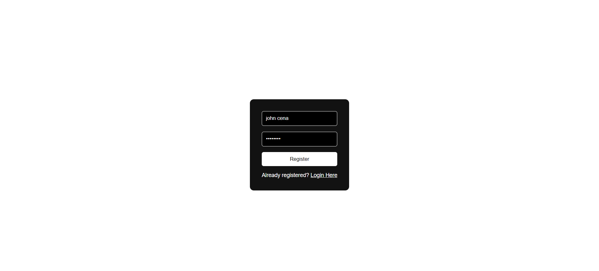
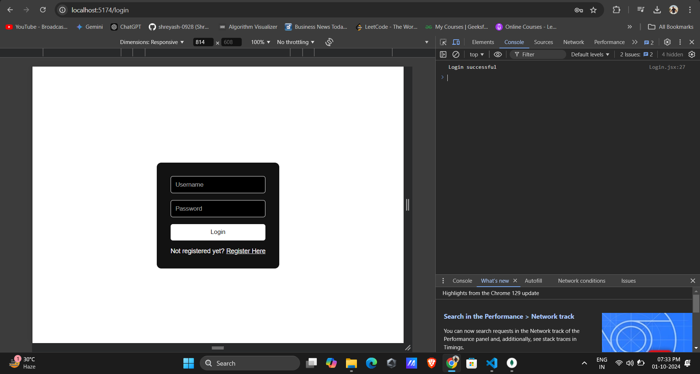
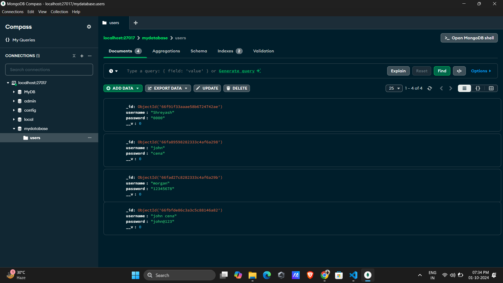

# MERN Stack Login & Registration Page

This project is a **Login and Registration** page built using the **MERN (MongoDB, Express.js, React.js, Node.js)** stack. The goal of this project is to showcase my understanding of the MERN stack and my ability to build authentication features using a modern web development framework.

## 🚀 Features

- User registration with form validation
- Login with existing credentials
- Password hashing for security
- JWT-based authentication
- Responsive design for all screen sizes

## 🛠️ Technologies Used

- **Frontend**: React, Axios, React Router DOM
- **Backend**: Node.js, Express.js
- **Database**: MongoDB with Mongoose for data management
- **Authentication**: JSON Web Tokens (JWT)
- **Dev Tools**: Vite, Nodemon, ESLint

## 📸 Screenshots

### Registration Page

### Login Page

### Database

